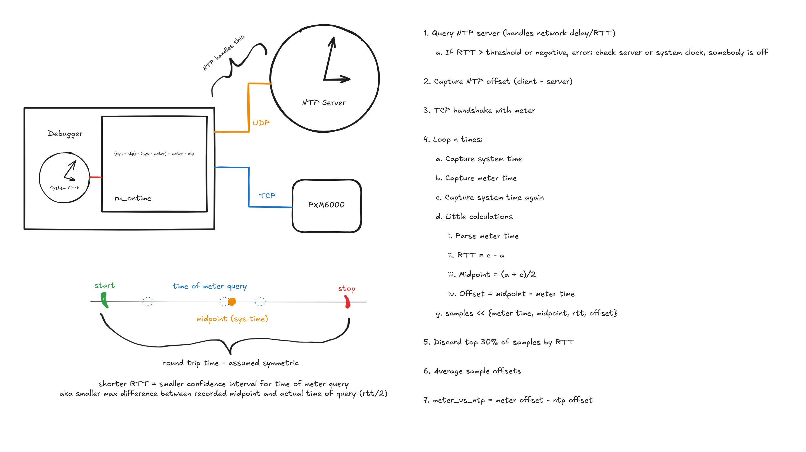

# ru_ontime

Simple command line tool to sanity check time synchronization between an NTP server and a PXM meter

## Description

Queries NTP server and gets offset from system clock. Queries meter time and gets the offset from system clock by sampling and averaging the samples with the lowest round-trip times. Offsets are compared to get the difference between the meter time and the NTP server time.



### Dependencies

* Working Ruby environment

### Installing

```
git clone https://github.com/hahodgins/ru_ontime.git
cd ru_ontime
bundle
```

### Executing program

```
# test_time.rb needs the NTP server address, meter ip address, and a range of registers to poll
./test_time.rb ntp_server_address meter_ip reg_start..reg_end

# firmwaregrab.rb just needs the meter ip address and firmware register
./firmwaregrab.rb meter_ip firmware_reg
```

## Version History

* 0.1
    * Initial Release

## Resources

* [net-ntp gem](https://github.com/zencoder/net-ntp)
* [example usage of net-ntp gem](https://codingkata.tardate.com/ruby/ntp/example.rb)
